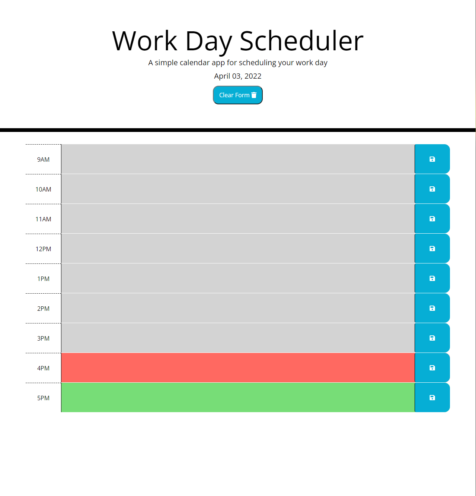

# Work Day Scheduler Starter Code
This is a daily planner intended for employees with a busy schedule. The application will track the date and time. The end user can click into a time block and enter an event. When saved, it will be added to local storage. A clear button has been added for convenience.

This project utilizes HTML, CSS and Javascript.

Website: https://snowslurpie.github.io/work-day-scheduler/

